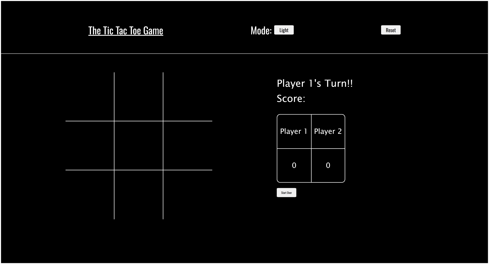
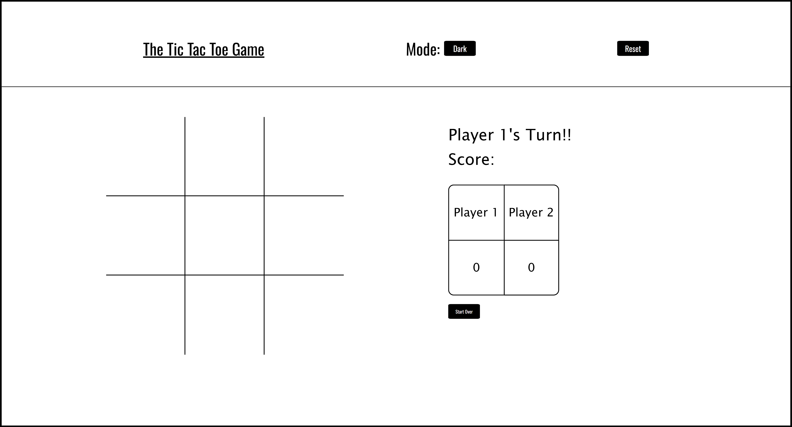
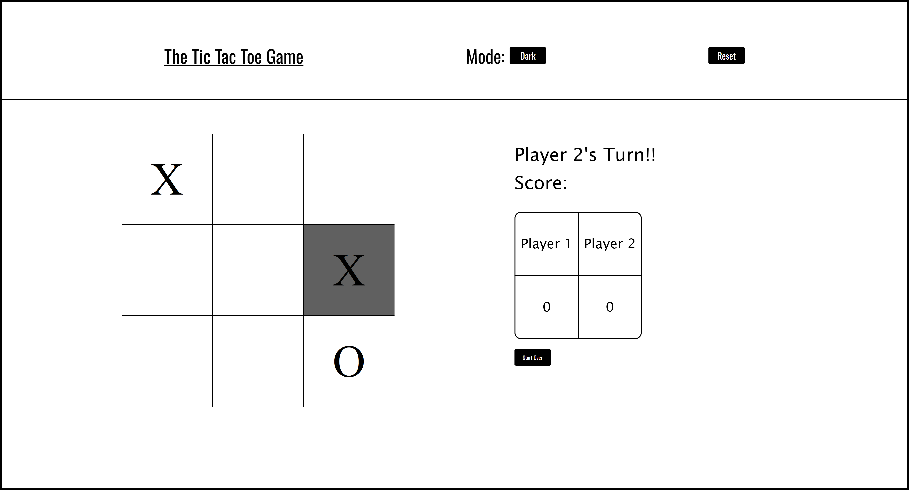
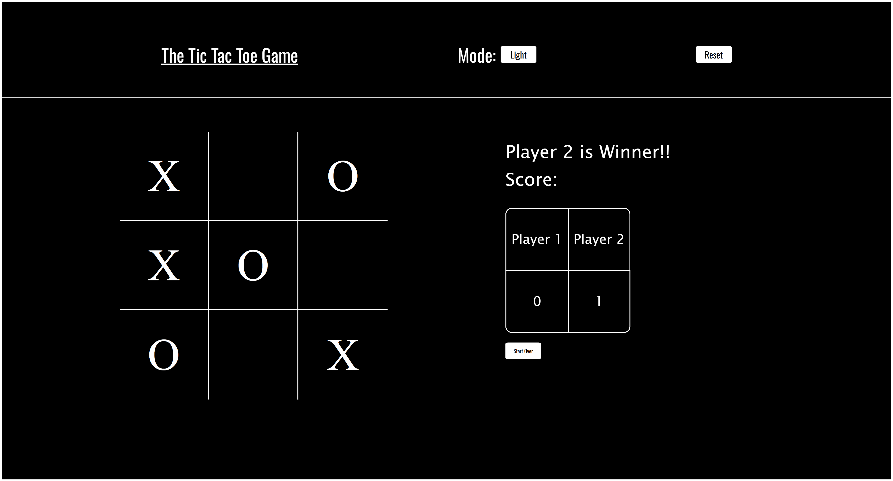
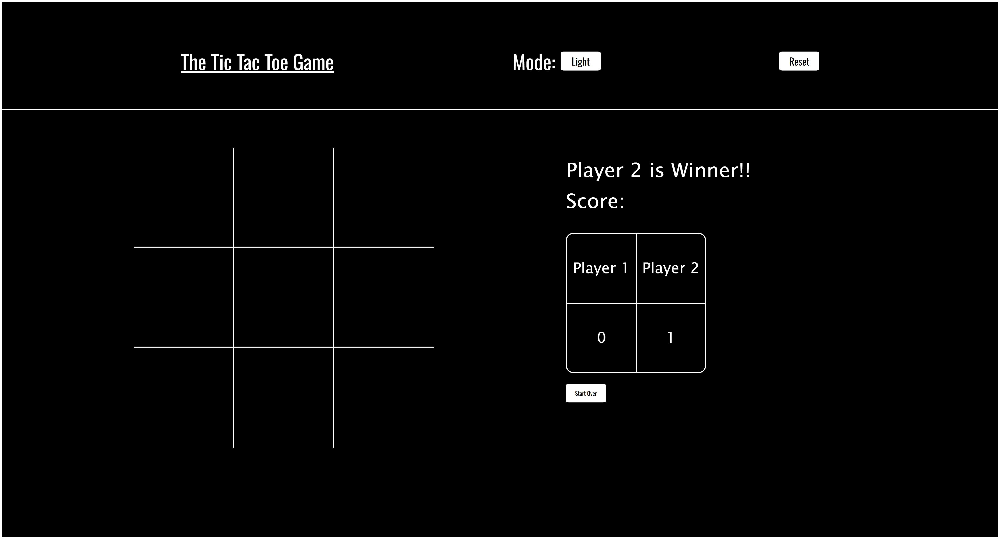

# Tic-Tac-Toe Game

A classic Tic-Tac-Toe game built using HTML, CSS, and JavaScript. Play against a friend or challenge yourself in this timeless 3x3 grid game.

## 📸 Screenshots

### 1. Game Interface With Dual Themes!

  
  
  

The main game board where players take turns to place their marks (X or O) in the 3x3 grid with dual themes that can be toggled using "Mode" button.  
      

### 2. Player Turn Indicator

Shows whose turn it is (Player X or Player O) during the game.

### 3. Game Over Screen

  
  

    

Displays the outcome of the game, whether it's a win or a draw, along with an option to start another game using "Start Over" button and reset the scoreboard using "Reset" button.

### 4.🛠️ Features
- Two-player gameplay on the same device.  
- Responsive design suitable for both desktop and mobile browsers.  
- Clear indication of the current player's turn.  
- Game outcome display with options to restart.  
- No external libraries or frameworks required.  

